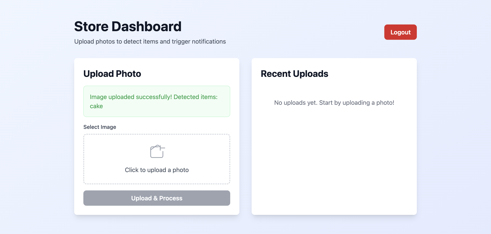
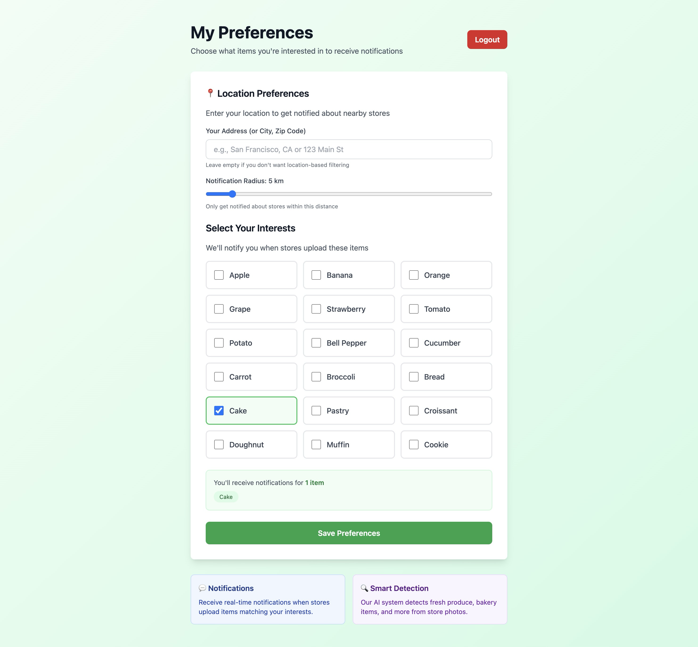
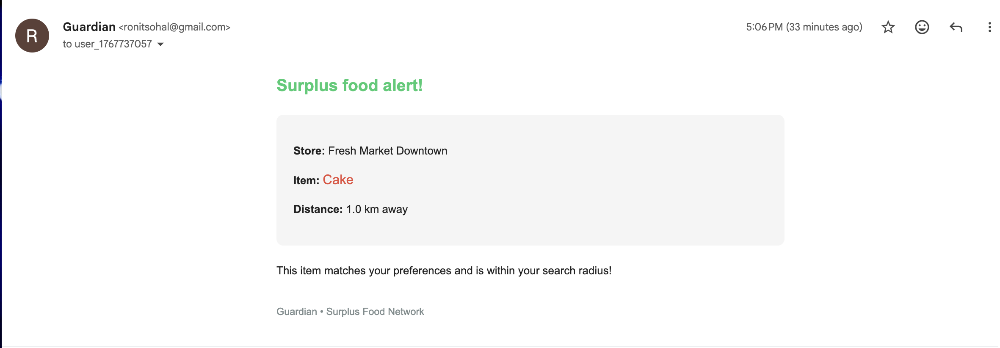
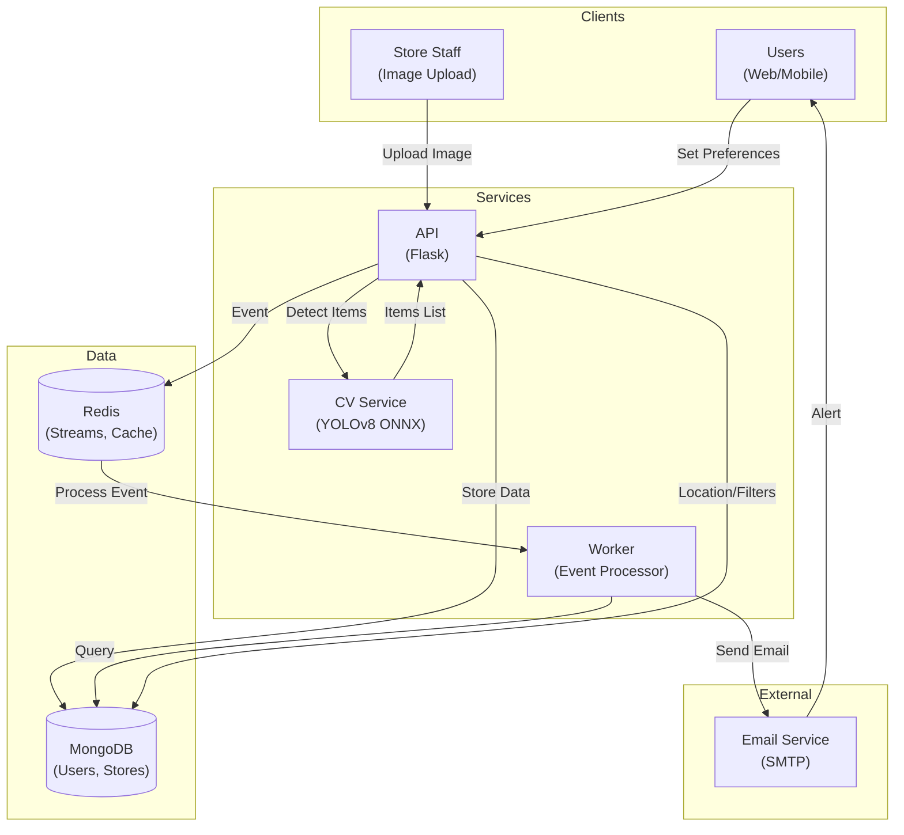
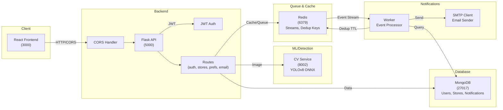

# Guardian - Surplus Food Notification Network

Connecting stores with surplus food to users in their community. Real-time detection, intelligent matching, and instant notifications.

## Features

- **🎥 Computer Vision**: YOLOv8 ONNX model detects 18 food categories (produce, bakery items)
- **📍 Geolocation**: Haversine distance calculation with customizable radius matching
- **🔔 Smart Notifications**: Email alerts matched to user preferences and proximity
- **🏪 Store Portal**: Easy image upload with automatic food detection
- **👤 User Dashboard**: Set preferences, view nearby matches, track history
- **⚡ Real-time**: Redis event streaming with deduplication
- **🔐 Secure**: JWT authentication, password hashing with bcrypt

## Screenshots & Demo

### Store Dashboard - Upload Surplus Food

Upload images of surplus food with automatic YOLO detection and geocoded location.

### User Dashboard - Get Notified

Set preferences, location radius, and receive real-time alerts for matching food nearby.

### Email Notification - Stay Updated

Receive instant email alerts when surplus food matching your preferences becomes available.

## Quick Start

### Prerequisites
- Docker & Docker Compose
- Node.js 18+ (for frontend development)
- Python 3.11+ (for local development)

### Installation

```bash
# Clone repository
git clone <repo-url>
cd Guardian

# Start all services
docker compose up -d --build

# Verify services are running
curl http://localhost:5000/health
curl http://localhost:3000
```

Services will be available at:
- **Frontend**: http://localhost:3000
- **API**: http://localhost:5000 (hosted at :5001)
- **CV Service**: http://localhost:8002

## Project Structure

```
Guardian/
├── frontend/               # React + TypeScript + Tailwind
│   ├── src/
│   │   ├── pages/         # Home, Store Portal, User Portal
│   │   ├── services/      # API client, auth, geocoding
│   │   └── components/    # Reusable UI components
│   └── Dockerfile
│
├── api/                    # Flask backend
│   ├── routes/            # Auth, stores, preferences, email
│   ├── core/              # Email service, auth logic, Redis client
│   ├── db/                # MongoDB connection
│   └── Dockerfile
│
├── cv/                     # YOLOv8 inference service
│   ├── app.py             # ONNX inference endpoint
│   ├── model/             # Training scripts, data
│   └── Dockerfile
│
├── worker/                 # Event processor
│   ├── worker.py          # Redis stream consumer
│   ├── email_client.py    # Email sending
│   └── Dockerfile
│
├── docker-compose.yml      # Service orchestration
└── README.md
```

## Architecture

### System Flow



### Service Architecture



## API Endpoints

### Authentication
- `POST /auth/signup` - Register new user/store
- `POST /auth/login` - Login and get JWT token

### Stores
- `POST /stores` - Create store with location (geocoded)
- `GET /stores` - List stores
- `POST /upload-test` - Upload image for detection

### User Preferences
- `POST /prefs` - Set user preferences (items, location, radius)
- `GET /prefs` - Get current preferences

### Email
- `POST /email/send` - Send manual test notification (auth required)

## Configuration

### Environment Variables

```bash
# API
FLASK_ENV=production
MONGO_URI=mongodb://db:27017
REDIS_URL=redis://redis:6379/0

# CV
MODEL_PATH=/app/models/best.onnx

# Email (SMTP)
SMTP_SERVER=smtp.gmail.com
SMTP_PORT=587
SENDER_EMAIL=your-email@gmail.com
SENDER_PASSWORD=your-app-password
SENDER_NAME=Guardian

# Geolocation
NOMINATIM_URL=https://nominatim.openstreetmap.org
```

## Model & Detection

The CV service uses **YOLOv8n** (nano) ONNX for real-time detection:

### Supported Categories (18 classes)
- **Produce**: apple, banana, orange, grape, strawberry, tomato, potato, bell_pepper, cucumber, carrot, broccoli
- **Bakery**: bread, cake, pastry, croissant, doughnut, muffin, cookie

Inference resolution: 640x640
Format: ONNX Runtime

## Docker Commands

```bash
# Start all services (build if needed)
docker compose up -d --build

# Stop all services
docker compose down

# View logs
docker compose logs -f api
docker compose logs -f cv
docker compose logs -f worker

# Rebuild specific service
docker compose up -d --build frontend
docker compose up -d --build api
docker compose up -d --build cv
docker compose up -d --build worker
```

## Health Checks

```bash
# API health
curl http://localhost:5000/health

# Redis connectivity
curl http://localhost:5000/redis-test

# MongoDB connectivity
curl http://localhost:5000/mongo-test
```

## Development

### Frontend Development
```bash
cd frontend
npm install
npm run dev
```

### Backend Development
```bash
cd api
pip install -r requirements.txt
python app.py
```

### Running Worker Locally
```bash
cd worker
pip install -r requirements.txt
python worker.py
```

## Testing

### End-to-End Test Flow
```bash
# Run complete test (register store/user, upload image, verify notifications)
./test_flow.sh
```

This script:
1. Registers a test store with location
2. Registers a test user with preferences
3. Uploads a test image
4. Verifies food detection
5. Checks notification creation
6. Confirms email sending

## Technology Stack

| Layer | Technology |
|-------|-----------|
| **Frontend** | React 18, TypeScript, Tailwind CSS, Vite, React Router |
| **Backend** | Flask 3.0, PyJWT, bcrypt, Flask-CORS |
| **ML/Detection** | YOLOv8 ONNX Runtime, OpenCV |
| **Queue/Cache** | Redis (Streams, TTL keys) |
| **Database** | MongoDB |
| **Email** | SMTP (Gmail/Outlook/SendGrid) |
| **Geolocation** | Nominatim API, Haversine formula |
| **Infrastructure** | Docker, Docker Compose |

## Data Models

### Store
```json
{
  "_id": "ObjectId",
  "email": "store@example.com",
  "name": "Fresh Market Downtown",
  "phone": "+1234567890",
  "location": {
    "address": "123 Main St",
    "lat": 40.7128,
    "lng": -74.0060
  },
  "created_at": "2025-01-06T..."
}
```

### User
```json
{
  "_id": "ObjectId",
  "email": "user@example.com",
  "item_filters": ["apple", "bread", "cake"],
  "location": {
    "address": "456 Oak Ave",
    "lat": 40.7580,
    "lng": -73.9855
  },
  "radius_km": 2,
  "notify": true,
  "created_at": "2025-01-06T..."
}
```

### Notification
```json
{
  "_id": "ObjectId",
  "user_id": "ObjectId",
  "store_id": "ObjectId",
  "item": "apple",
  "distance_km": 1.23,
  "event_id": "redis-event-id",
  "timestamp": 1704571000,
  "read": false
}
```

## Roadmap

- [ ] Mobile app (React Native/Flutter)
- [ ] Advanced ML model (multi-item detection, confidence scores)
- [ ] SMS notifications
- [ ] In-app messaging
- [ ] Analytics dashboard
- [ ] Integration with food rescue organizations
- [ ] Blockchain verification for stores
- [ ] Machine learning on user preferences
