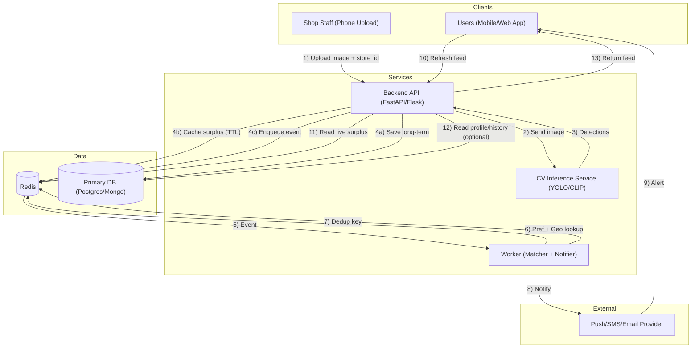
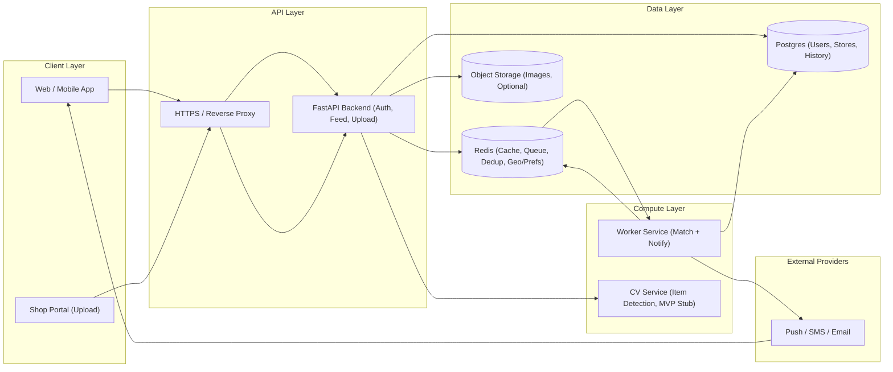

# Guardian

## System Diagram

```mermaid
flowchart TD

%% Lanes keep the diagram readable
subgraph Clients
  U["Users (Mobile/Web App)"]
  S["Shop Staff (Phone Upload)"]
end

subgraph Services
  API["Backend API (FastAPI/Flask)"]
  CV["CV Inference Service (YOLO/CLIP)"]
  W["Worker (Matcher + Notifier)"]
end

subgraph Data
  R[("Redis")]
  DB[("Primary DB (Postgres/Mongo)")]
end

subgraph External
  N["Push/SMS/Email Provider"]
end

%% Main flow
S -->|"1) Upload image + store_id"| API
API -->|"2) Send image"| CV
CV -->|"3) Detections"| API

API -->|"4a) Save long-term"| DB
API -->|"4b) Cache surplus (TTL)"| R
API -->|"4c) Enqueue event"| R

R -->|"5) Event"| W
W -->|"6) Pref + Geo lookup"| R
W -->|"7) Dedup key"| R
W -->|"8) Notify"| N
N -->|"9) Alert"| U

U -->|"10) Refresh feed"| API
API -->|"11) Read live surplus"| R
API -->|"12) Read profile/history (optional)"| DB
API -->|"13) Return feed"| U
```

## Architecture Diagram

```mermaid
flowchart LR

subgraph Client["Client Layer"]
  U["Web / Mobile App"]
  S["Shop Portal (Upload)"]
end

subgraph API_Layer["API Layer"]
  LB["HTTPS / Reverse Proxy"]
  API["FastAPI Backend (Auth, Feed, Upload)"]
end

subgraph Compute["Compute Layer"]
  W["Worker Service (Match + Notify)"]
  CV["CV Service (Item Detection, MVP Stub)"]
end

subgraph Data["Data Layer"]
  R[("Redis (Cache, Queue, Dedup, Geo/Prefs)")]
  DB[("Postgres (Users, Stores, History)")]
  OBJ[("Object Storage (Images, Optional)")]
end

subgraph External["External Providers"]
  PUSH["Push / SMS / Email"]
end

U --> LB --> API
S --> LB --> API

API --> CV
API --> OBJ
API --> DB
API --> R

R --> W
W --> R
W --> DB
W --> PUSH

PUSH --> U
```
